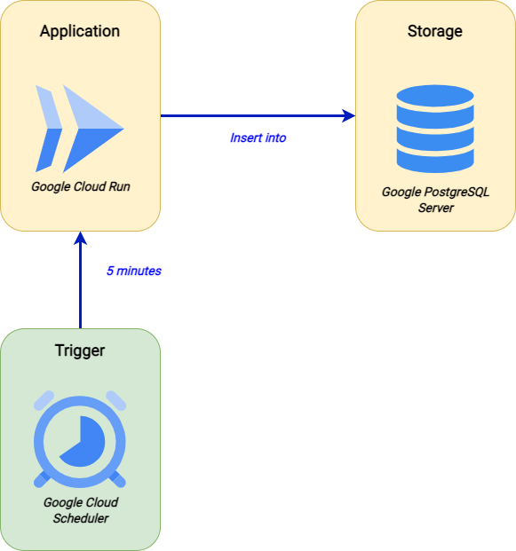

# Crypto Project
Project for Web Scraping, MLOps and Cloud Computing with Crypto data.

## Step 1 - Web Scraping + Database architectures

Core points:
<ul>
    <li><strong>Web Scraping:</strong> the web scraping objetive is get util data for this analisys. This step is contained in the Application layer in the figure above;</li>
    <li><strong>Storage:</strong> after the previous step, we need to save the scrapped data. For this, we can use an SGBG. This step is contained in the Storage layer;</li>
    <li><strong>Storage:</strong>we knows that data changes over time (mainly cryptocurrencies). In this way, we need to get the data in a recurring and consistent way throughout the day, that is, every two minutes, 
    as shown in Trigger layer.</li>
    
</ul>

After this process, we have a database that is being populated with about +- 400rows/minute (4 variables * +- 100 crypto's).